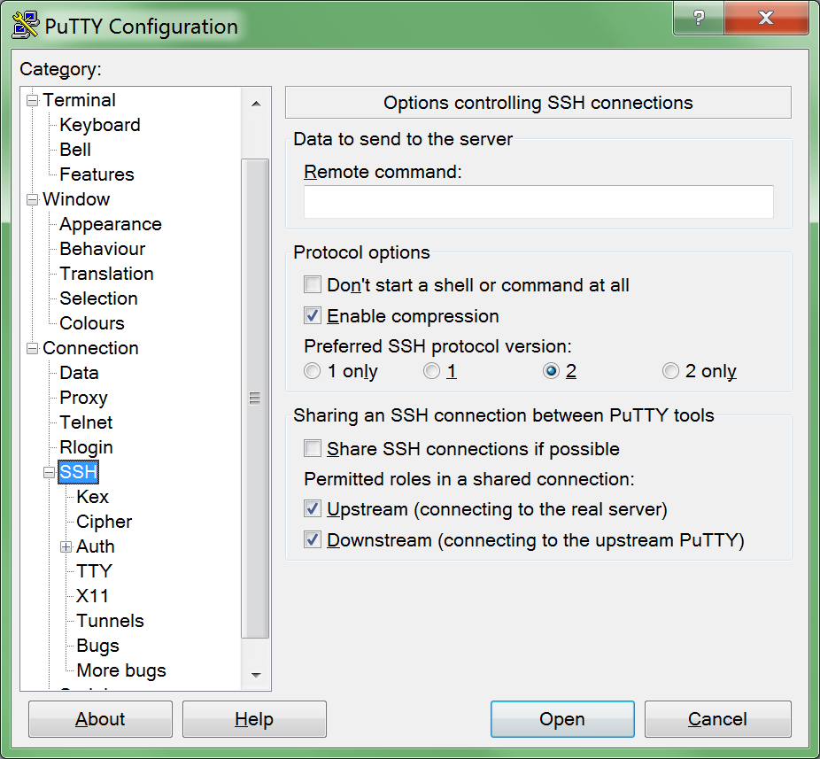
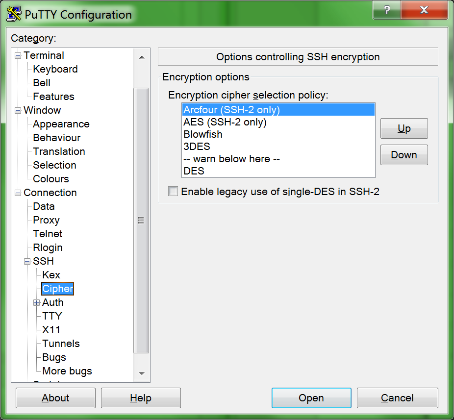
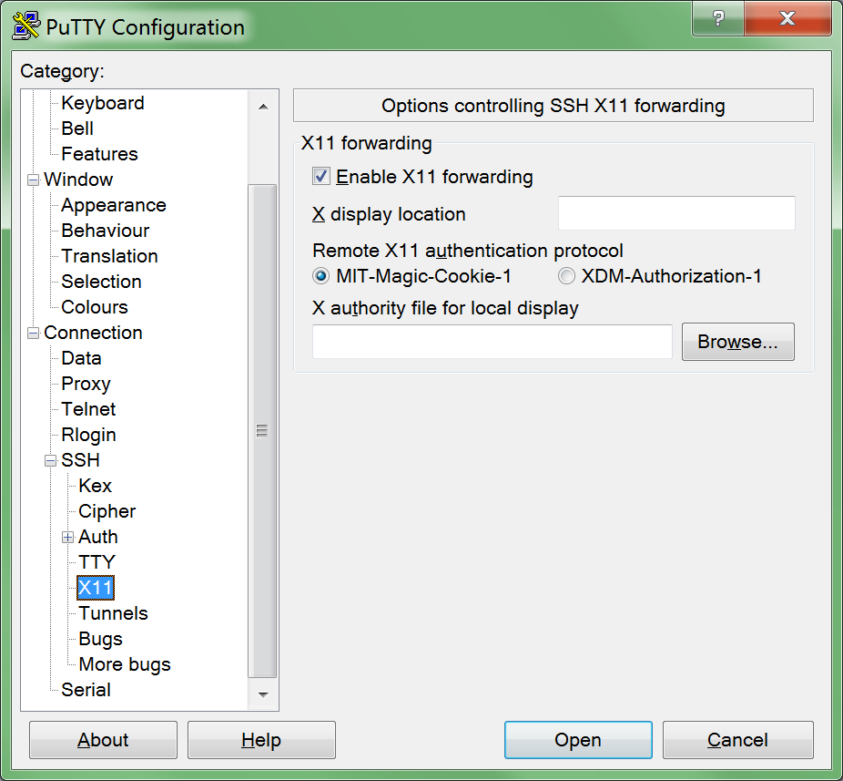
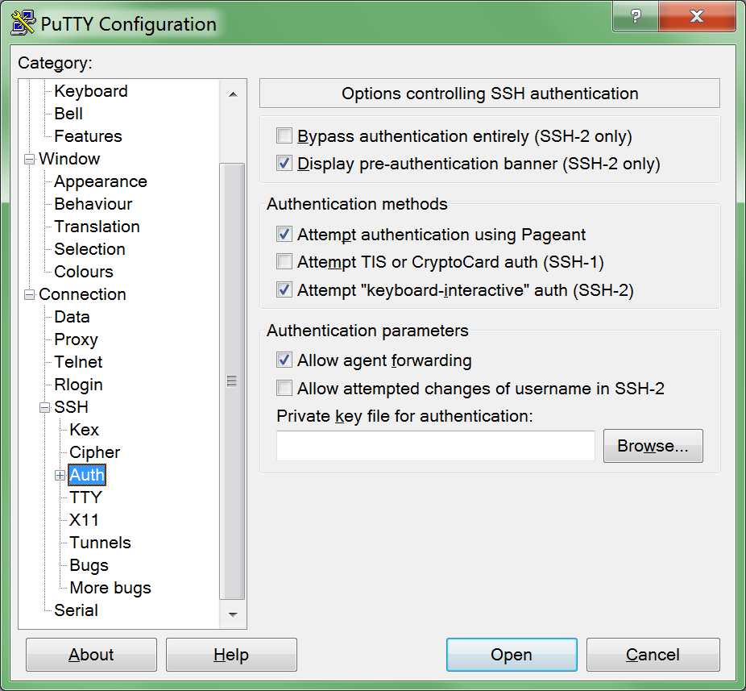
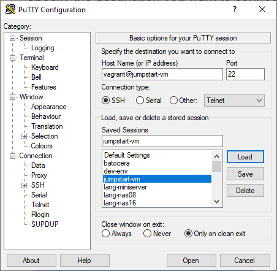

Headless-Betrieb mit X-Forwarding
=================================

Diese VM ist auf Headless-Betrieb mittels x11-Server ausgelegt.
Dazu werden neben der eigentlichen VM noch andere Tools benötigt.

Einrichten
==========

In dieser Anleitung gehen wir Schritt für Schritt durch das Einrichten der Headless-Verwendung.
Die hier beschriebenen Tools etc. sind für eine Windows-Umgebung vorgesehen.

Putty
-----

Putty wird als SSH-Client verwendet.

### Putty installieren

* Lade Putty herunter: [Putty](https://www.putty.org/)
* Installiere Putty mit Standard-Einstellungen

### Putty Session einrichten

* Starte Putty
* Stelle folgende Daten ein:
  * SSH -> Enable compression
  * SSH -> Cipher -> Setzten Sie `Arcfour` an die erste Stelle der Liste
  * SSH -> X11 -> Enable X11 forwarding
  * SSH -> Auth -> Allow agent forwarding
  * Session -> Host Name: `vagrant@jumpstart-vm`
  * Session -> Port: `22`
  * Session -> Saved Sessions: `jumpstart-vm`
* Klicke auf `Save`
* Die gespeicherte Session kann später für die Verbindung zur VM verwendet werden.

X11-Server
----------

Damit wir die grafischen Oberflächen der Tools in der Linux-VM später auf dem Windows-Desktop nutzen können,
müssen wir einen entsprechenden X11-Server auf Windows installieren.

* Lade ihn hier herunter: [VcXsrv](https://sourceforge.net/projects/vcxsrv/)
* Installiere ihn mit Standard-Einstellungen
* Starte den X-Server mittels der Verknüpfung auf dem Desktop und wähle `Multiple Windows`
* Alle weiteren Optionen sollten auf Default belassen werden.

Wenn du den X-Server später automatisch beim Windows-Startup starten möchtest,
erstelle eine entsprechende Verknüpfung zu `vcxsrv.exe`.

* Drücke `Win + r` für den Ausführen-Dialog
* Gib `shell:Startup` ein und drücke OK
* Erstelle im geöffneten Ordner eine neue Verknüpfung mittels:
  `Rechtsklick` -> `Neu` -> `Verknüpfung`
* Gib folgendes Ziel inkl. Parameter ein.
  Passe bei Bedarf den Pfad zum Binary an.

~~~
"C:\Program Files\VcXsrv\vcxsrv.exe" :0 -ac -terminate -lesspointer -multiwindow -clipboard -wgl
~~~

Sollte der X-Server evtl. mal abstürzen, kannst du die gleiche Verknüpfung nochmals
auf dem Desktop erstellen, damit du den X-Server bei Bedarf manuell starten kannst.

### HiDPI/4K Displays

Um auf hochauflösenden Displays eine scharfe Darstellung der GUIs zu erhalten,
sollte die Skalierung durch Windows für den X11-Server deaktiviert werden.

* `Rechtsklick` auf die `vcxsrv`-Verknüpfung -> `Eigenschaften` -> `Kompatibilität` -> `Hohe DPI-Einstellungen ändern`
* `Hohe DPI-Skalierung überschreiben` -> Aktivieren und `Anwendung` auswählen

Ab jetzt werden keine X11-GUIs mehr durch Windows skaliert.
Falls das GUI mit zu kleinen Elementen gerendert wird,
setzte die folgende Variable später in der VM im `~/.bashrc`.
Für ein 4K-Display z.B. auf den Wert `2`.
Nur Integer-Werte sind erlaubt.

~~~~~~
export GDK_SCALE=2
~~~~~~

> Siehe auch: [blurry-fonts-on-using-windows-default-scaling-with-wsl-gui-applications-hidpi](https://superuser.com/questions/1370361/blurry-fonts-on-using-windows-default-scaling-with-wsl-gui-applications-hidpi)

Verwendung
==========

Verbinde dich mit der erstellten Session in Putty (`jumpstart-vm`) mittels der laufenden VM.
Die IDE etc. startet man nun über die CLI.
Z.B.: `clion &` oder `intellij &`.
GUIs werden nun direkt auf dem Windows-Desktop angezeigt.

Austauschen von Dateien zwischen VM und Host
--------------------------------------------

Probiere zuerst die Variante mit dem SMB-Share.
Diese sollte einfacher einzurichten sein.

### Variante sftp

Da wir für Putty bereits die SSH-Verbindung verwenden, können wir diese auch für den Datei-Austausch einsetzten.
Dies wird mittels dem `sftp`-Protokol ermöglicht.

Ein guter Datei-Manager, welcher dieses Protokol unterstützt ist z.B. `TotalCommander`.
Lade ihn unter [www.ghisler.com/ddownload.htm](https://www.ghisler.com/ddownload.htm) herunter.
Lade zudem das `sftp`-Plugin hier [www.ghisler.com/dplugins.htm](https://www.ghisler.com/dplugins.htm) herunter.
Installiere dieses, indem du es im TotalCommander doppelklickst.
Evtl. muss dieser als Administrator laufen, um das Plugin richtig zu installieren.

Das Plugin findet sich nun in der `Netzwerkumgebung` des TotalCommanders.
Richte es mit den gleichen Einstellungen wie die Putty-Session ein.
